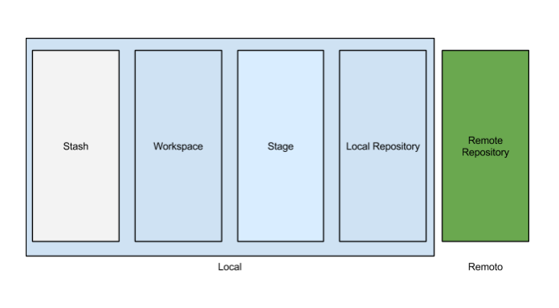

# Control de versiones mediante Git

Material para el seminario de *control de versiones*, *Git* y *GitHub* del 06/03/2018.

## ¿Qué es un sistema de control de versiones?

Se trata de un software que permite gestionar los **cambios** que se van realizando sobre un conjunto de ficheros. Esto nos permite:
* Recuperar en cualquier momento versiones válidas del código.
* Etiquetar versiones específicas.
* Permitir trabajo simultáneo de varios desarrolladores.
* Organizar ficheros y evitar la réplica de los mismos.

 Algunos de los *VCS* más conocidos pueden ser git, tfs, svn o mercurial.

**Git** surge como un VCS sencillo, rápido, descentralizado y muy escalable.

## ¿Cómo funciona Git?

Git registra en la carpeta `.git` los cambios que se han realizado en código fuente desde la última versión. A partir de estos cambios se genera la siguiente versión o *commit*.

Los ficheros que no han cambiado no se copian a la nueva versión... ¡ni siquiera los que sí lo han hecho! :cyclone:

:white_check_mark: Ventajas de esto
* Evita la réplica de código
* Los commits son como pequeños *parches transferibles*
* En cualquier momento podemos cambiar de commit de forma instantánea

### Git workflow

* Repositorio remoto
  > Es una copia completa del historial de versiones del proyecto. Contiene información suficiente para reconstruir cualquier versión del mismo.

* Repositorio local
 > Es una copia completa del repositorio remoto. Al igual que el repositorio remoto, contiene toda la información del proyecto.

* Workspace, working directory, working tree, ...
  > Se refiere a los ficheros que hay en nuestro ordenador.

* Staging area o index
  > Es una caché de los ficheros que se van a añadir o cambiar al repositorio local. Una especie de observador del workspace.

* Stash
  > Es una especie de papelera de reciclaje, se suele llamar dirty directory.

 

## Paso a la práctica

A priori, el uso de git puede parecer muy complejo. En realidad hay muchísimas operaciones que pueden realizarse y git ofrece un set de operaciones muy completo, de la forma más sencilla posible siendo útil para proyectos pequeños y manteniendo la utilidad en proyectos muy grandes.

* Comandos básicos :ok_hand:

  * `git init`
    > Inicia un nuevo repositorio en el directorio actual.

  * `git status`
    > Muestra el estado actual de la rama, como los cambios que hay sin commitear.

  * `git log`
    > Muestra un resumen de los últimos commits.

  * `git show`
    > Muestra información del commit actual.

  * `git add <nombre_archivo>`
    > Comienza a trackear el archivo “nombre_archivo”.

  * `git commit -am "<mensaje>"`
    > Confirma los cambios realizados. El “mensaje” generalmente se usa para asociar al commit una breve descripción de los cambios realizados.

  * `git tag -a "<nombre_tag>"`
    > Crea una etiqueta en el commit actual. La etiqueta es un indicador de commit importante y posiblemente un release.

  * `git diff <nombre-archivo>`
    > Muestra las diferencias generadas en un archivo. Otro comando interesante es git patch.

   
Tutorial primeros pasos

 

  1. :wrench: Instala git mediante `sudo apt-get install git`.
  2. :open_file_folder: Entra en la carpeta de un proyecto y ejecuta `git init`.
  3. :pushpin: Usa `git status` para ver el estado de los archivos y `git add <archivo1> <archivo2> ...` para añadir trackear los archivos que desees.
  4. :sparkles: Crea el commit `git commit -m "Este es mi primerito commit no mas"` (te pedirá que configures git).
  5. :eyes: Observa los commits mediante `git show`, `git log` o `gitk`.
  </li>
      

  

* Comandos para ramas :evergreen_tree:

  * `git branch`
    > Lista todas las ramas locales.

  * `git branch -a`
    > Lista todas las ramas locales y remotas.

  * `git branch -d <nombre_rama>`
    > Elimina la rama local con el nombre “nombre_rama”.

  * `git checkout -b <nombre_rama_nueva>`
    > Crea una rama a partir de la que te encuentres parado con el nombre “nombre_rama_nueva”, y luego salta sobre la rama nueva, por lo que quedas parado en esta última.

  * `git merge <nombre_rama>`
    > Impacta en la rama en la que te encuentras parado, los cambios realizados en la rama “nombre_rama”.

    
Tutorial uso de ramas

 

  1. Partiendo de un proyecto Git, haz la rama mediante `git branch <nombre-rama>`.
  2. Puedes usar `git branch` para ver las ramas y `git checkout <nombre-rama>` para cambiarte a otra.
  3. Usa los mismos pasos 3. y 4. del tutorial anterior para crear un commit.
  4. Cambia a la rama master `git checkout master` y prueba a fusionarlas `git merge --no-ff <nueva-rama>`.
  </li>
      

  

* Comandos de repositorio remoto :globe_with_meridians:

  * `git remote`
    > Administra las direcciones remotas del repositorio local.

  * `git clone <url_repositorio>`
    > Descarga un proyecto git.

  * `git push origin <nombre_rama>`
    > Sube la rama “nombre_rama” al servidor remoto.

  * `git fetch`
    > Descarga los cambios realizados en el repositorio remoto.

  * `git pull`
    > Unifica los comandos fetch y merge en un único comando (descarga + integra commits).

      
Tutorial repositorio remoto

  

  Uso de repositorio remoto y GitHub.
  1. :v: Haz *fork* en GitHub de éste repositorio o el que tú quieras (lo copiará a tu perfil).
  2. :arrow_down: Clona el proyecto mediante `git clone <enlace-a-tu-repo>`.
  3. :memo: Modifica lo que quieras y observa los cambios mediante `git status` y `git diff <archivo>`.
  4. :paperclip: Añade los ficheros al index mediante `git add *`.
  5. :sparkles:  Crea el commit `git commit -m "Te reviento el proyecto"`.
  6. :octocat: Súbelo a *GitHub* con `git push origin master`.
  7. :bar_chart: Explora la sección *insights*.

  ¿Y si otra persona ha realizado cambios?
  1. :bookmark_tabs: `git fetch` para descargarnos la información del proyecto.
  2. :arrow_double_down: `git pull (origin/<nombre-rama>)` integrará los cambios en nuestro working directory.
   </li>
       

 

 

* Comandos de retorno :recycle:

  * `git reset --hard HEAD`
    > Elimina los cambios realizados que aún no se hayan hecho commit.

  * `git revert <hash_commit>`
    > Revierte el commit realizado, identificado por el “hash_commit”.

 

## Uso adecuado de ramas

Las ramas son de uso libre, pero en general deben tener uno de los siguientes usos según wikipedia:

* Master
Es la rama principal. Contiene el repositorio que se encuentra publicado en producción, por lo que **debe estar siempre estable**.

* Development
Es una rama sacada de master. Es la **rama de integración**, todas las nuevas funcionalidades se deben integrar en esta rama. Luego que se realice la integración y se corrijan los errores (en caso de haber alguno), es decir que la rama se encuentre estable, se puede hacer un merge de development sobre la rama master.

* Features
Cada **nueva funcionalidad** se debe realizar en una rama nueva, específica para esa funcionalidad. Estas se deben sacar de development. Una vez que la funcionalidad esté desarrollada, se hace un merge de la rama sobre development, donde se integrará con las demás funcionalidades.

* Hotfix
Son bugs que surgen en producción, por lo que se deben arreglar y publicar de forma urgente. Es por ello, que son ramas sacadas de master. Una vez corregido el error, se debe hacer un merge de la rama sobre master. Al final, para que no quede desactualizada, se debe realizar el merge de master sobre development (esto es para actualizar development con hotfix).

#### Conflictos

Surgen cuando se hace `merge` o `pull`. Tendremos que corregir el código que nos genera git y confirmar mediante un commit, o bien huir mediante `git merge --abort`.

#### Optimización gracias a .gitignore

El fichero `.gitignore` es un fichero dónde se especifica qué archivos o qué tipo de archivos no deben trackearse nunca. Se añade por ejemplo a este fichero binarios de compilación, configuraciones del IDE, ...

* Evita errores de configuración del IDE.
* Ahorra mucho espacio que sería malgastado.
* El código es más transferible.

Es recomendado extraerlo de internet y modificarlo si lo ves necesario.

 

## GitHub

:octocat: Es un servicio que oferta hosting para repositorios remotos y oferta las siguientes mejoras:
* Filosofía y herramientas colaborativas :busts_in_silhouette:.
* Funciones para organizar y gestionar proyectos :books:.
* Heramientas para realizar operaciones git importantes gráficamente :radio_button:.
* Muestra de información y estadísticas :information_source:.
* Herramientas para documentar y lanzar nuestra aplicación :arrow_right:.

Además de todo esto *GitHub* es una red social para programadores y un práctico portfolio.
